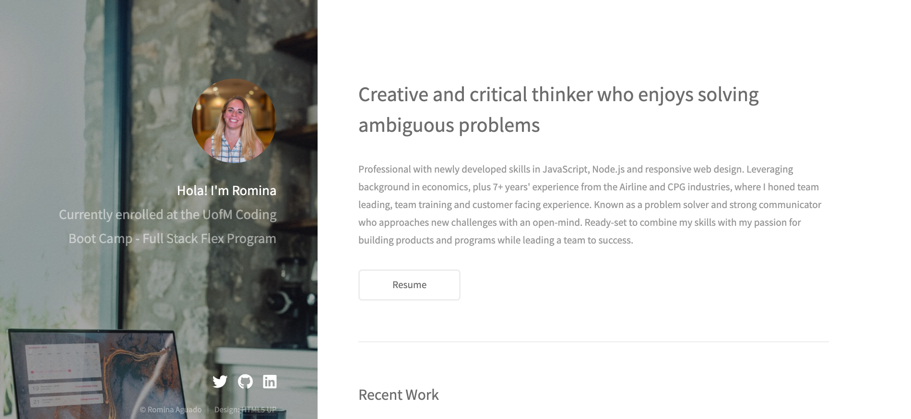

# React-Portfolio

## Description

The importance of having a professional online presence is more important than ever, and an online portfolio will certainly increase visibility and presence.
Creating a portfolio website allows to share and showcase work easily with the comunity.

## Deployed Link

https://boiling-castle-14312.herokuapp.com/

## Images

## Installation

To start the app use npm start

When running the code locally the local host is set to port 3000

## Languages

React.js  
99Inbound  
Heroku

## Contribute

The following is a set of guidelines for contributing. These are just guidelines, not rules, so use your best judgement and feel free to propose changes to this document in a pull request.

Issue: Ensure the bug was not already reported by searching on GitHub under issues. If you're unable to find an open issue addressing the bug, open a new issue. Write detailed information: For example:

How to reproduce the issue, step-by-step. The expected behavior (or what is wrong). Screenshots for GUI issues. The application version. The operating system.

Pull Requests: Pull Requests are always welcome.

When you edit the code, please run npm run test to check the formatting of your code before you git commit. Ensure the PR description clearly describes the problem and solution. It should include: The operating system on which you tested. The relevant issue number, if applicable.

## License

MIT

Copyright (c) 2021 Romina Aguado
